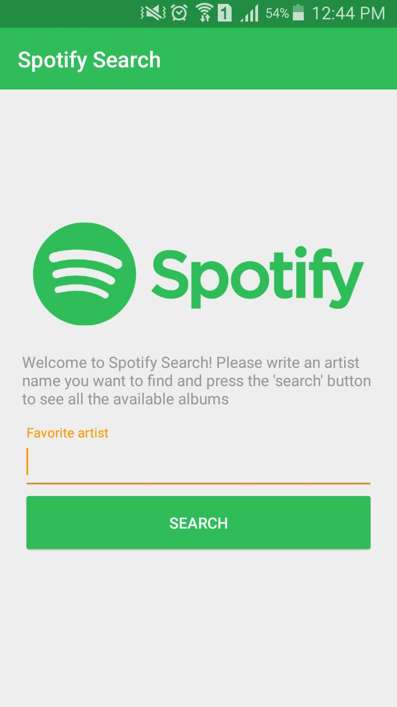
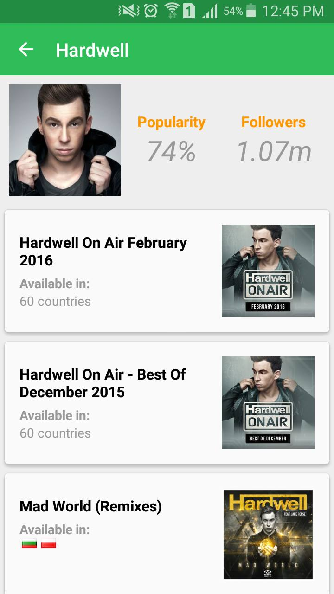
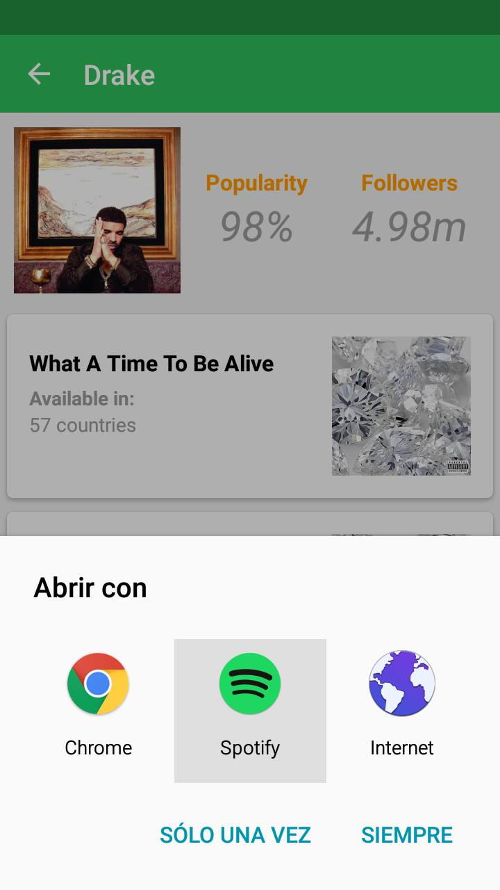

# Spotify Search

A simple Android Application using Material Design to consume few Spotify API services.

The Spotify's API is here: https://developer.spotify.com/web-api/

### Functionality

This application is really simple, it receives as an input the name of an artist, performs a search and shows
the first artist in the results in another view, showing his popularity, followers and a full list of albums.

When the user clics on an album, the browser or the Spotify App will be opened in the selected album.

### A couple of screenshots

### Try it yourself

Just download the project, import it using Android Studio, compile and run it.
